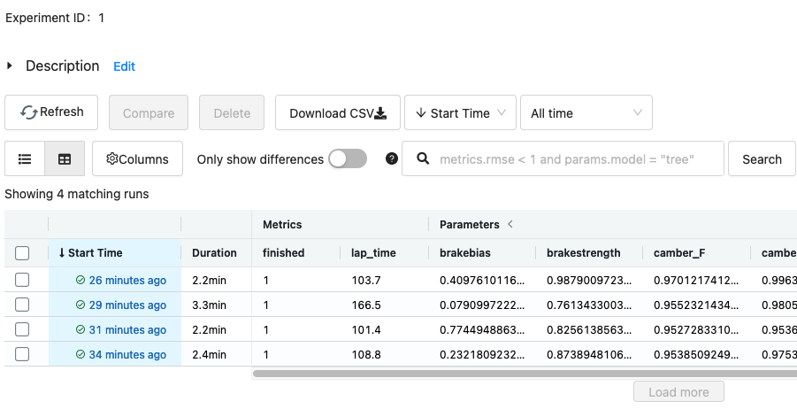

# BeamNG simulation environments

BeamNG.drive/tech based simulation environments.


# Setup

## Local (Linux or Windows)

1. Obtain and install BeamNG.tech or BeamNG.drive (e.g. from Steam) - https://www.beamng.com/game/
2. Create the intended user path, e.g. ```/beamng_workspace/```
3. Inside that directory create ```ResearchHelper.txt```
4. Create a ```mods``` directory with the version of BeamNG, eg. ```/beamng_workspace/0.25/mods/```
5. Put the ```BeamNGpy.zip``` file included in this repo into the directory created in step 4.
6. Setup a python environment, e.g using Conda:
   ```bash 
   conda create -y --name beamng-envs python=3.8
   conda activate beamng-envs
   ```
7. Install requirements:
   ```bash
   pip install -r requirements.txt
   ```

Future details on setting up and using BeamNG via its Python API can be found here https://github.com/BeamNG/BeamNGpy

# Usage

## Running from Python

````python
from beamng_envs.beamng_config import BeamNGConfig
from beamng_envs.envs.track_test.track_test_param_space import TRACK_TEST_PARAM_SPACE_GYM
from beamng_envs.envs.track_test.track_test_env import TrackTestEnv
from beamng_envs.envs.track_test.track_test_config import TrackTestConfig

# Set paths are required
track_test_config = TrackTestConfig(
     output_path='track_test_results',
     bng_config=BeamNGConfig(
         home='T:/Program Files (x86)/Steam/steamapps/common/BeamNG.drive',
         user="C:/beamng_workspace/"
     )
 )
param_set = TRACK_TEST_PARAM_SPACE_GYM.sample()
env = TrackTestEnv(params=param_set, config=track_test_config)
results, history = env.run()
````

## Running example scripts

There are a number of scripts that demo running an environment and collecting the result to MLflow. The input args are the same for each, and require the BeamNG paths to be set.

### Track Test
Sets a car config for the Scintila Rally car, use an AI to drive a lap of the track, and record lap time and sensor data.

```bash
python -m scripts.run_batch_track_tests -N 5 --beamng_path /SteamLibrary/steamapps/common/BeamNG.drive --beamng_user_path /beamng_workspace/
```

### Crash test
Searches for all available car templates, selects one, then drive it into a barrier in the destruction section of grid map v2 at a set speed. Records sensor data.

```bash
python -m scripts.run_batch_crash_tests -N 5 --beamng_path /SteamLibrary/steamapps/common/BeamNG.drive --beamng_user_path /beamng_workspace/
```

### Drag strip
Selects a totally random part config for the Hirochi Sunburst car, then races it down the dragstrip in grid map v2. Records time, speed, etc. along with sensor data.

```bash
python -m scripts.run_batch_drag_strip -N 5 --beamng_path /SteamLibrary/steamapps/common/BeamNG.drive --beamng_user_path /beamng_workspace/
```

The MLflow logging shown in the examples is optional; full results are saved to disk in the output directory in json format.

### Viewing results
The `DiskResults` class can be used to load saved results from an environment output folder or from an on disk MLflow experiment. It automates loading the saved json data into Pandas formats.

Foe example to load the results from an experiment and to access the timeseries sensor data and other scalar params/results:
```python
from beamng_envs.data.disk_results import DiskResults

# Load from the environment output path = this can be passed from an existing env directly, using
# env.disk_results.output_path, or as disk path if the evn is no longer in memory.
full_results = DiskResults.load(path='track_test_results/[uuid for result]')

# Access the timeseries sensor data (pd.DataFrame)
timeseries_df = full_results.ts_df

# Access the scalar params/results (pd.Series)
scalars = full_results.scalars_series
```
See [run_single_track_test.py](scripts/run_single_track_test.py) for a more complete example.

### Viewing results in MLflow UI

```bash
mlflow ui -h 0.0.0.0 -p 5555
```

http://0.0.0.0:5555



# Compatibility

Each version of the Beamng python api supports specific versions of Beamng -
see https://github.com/BeamNG/BeamNGpy#compatibility

The environments here are compatible with the following versions:

| Beamng version | beamngpy version | beamng-envs version | Supported envs                     |
|----------------|------------------|---------------------|------------------------------------|
| 0.28           | 1.26             | 0.5.0               | Track test, crash test, drag strip |
| 0.28           | 1.26             | 0.3.0 - 0.4.0       | Track test                         |
| 0.27           | 1.25.1           | 0.3.0               | Track test                         |
| 0.26           | 1.24             | 0.2.0               | Track test                         |
| 0.24           | 1.22             | 0.1.0               | Track test                         |
